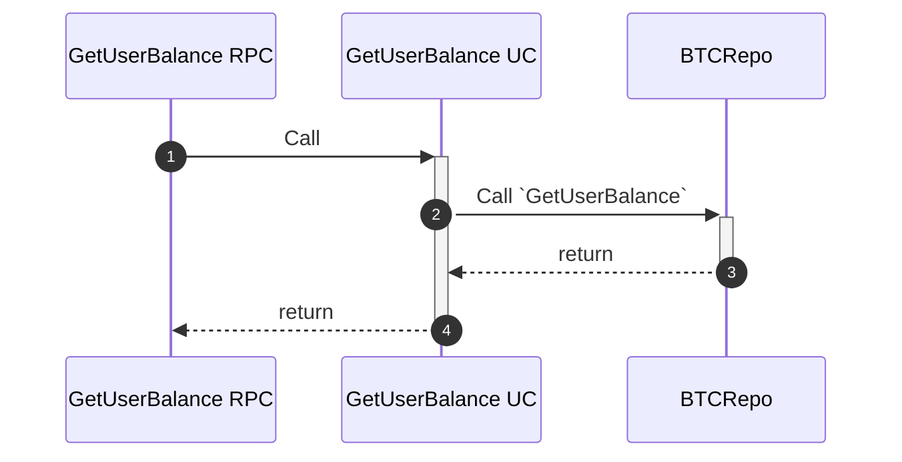

### GetUserBalance RPC - Sequence Diagram

```mermaid
sequenceDiagram
	autonumber
	participant RPC as GetUserBalance RPC
	participant UC as GetUserBalance UC
	participant BTCR as BTCRepo

	RPC->>+UC: Call
	UC->>+BTCR: Call `GetUserBalance`
	BTCR-->>-UC: return
	UC-->>-RPC: return
```

